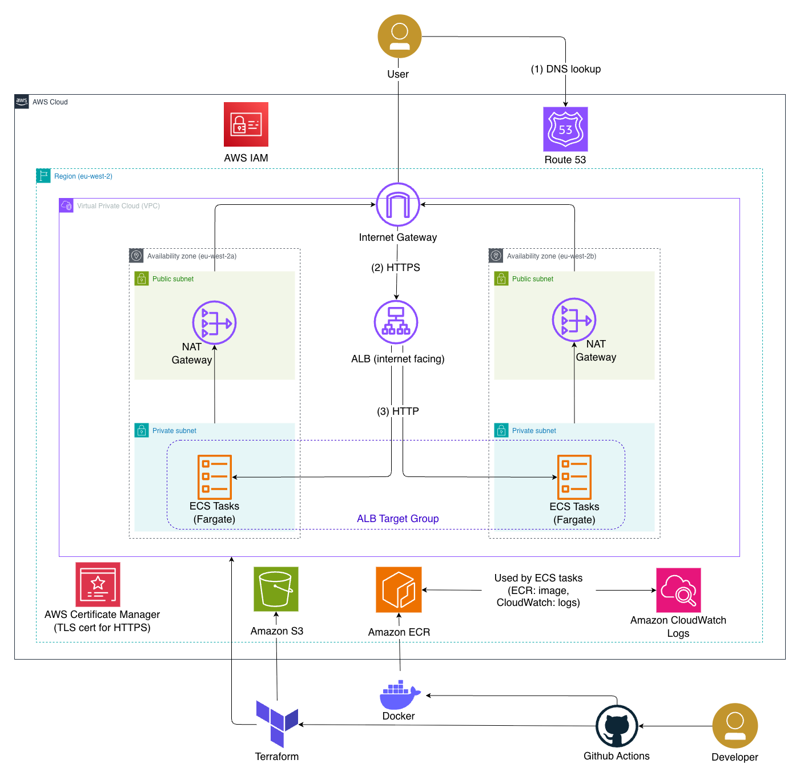
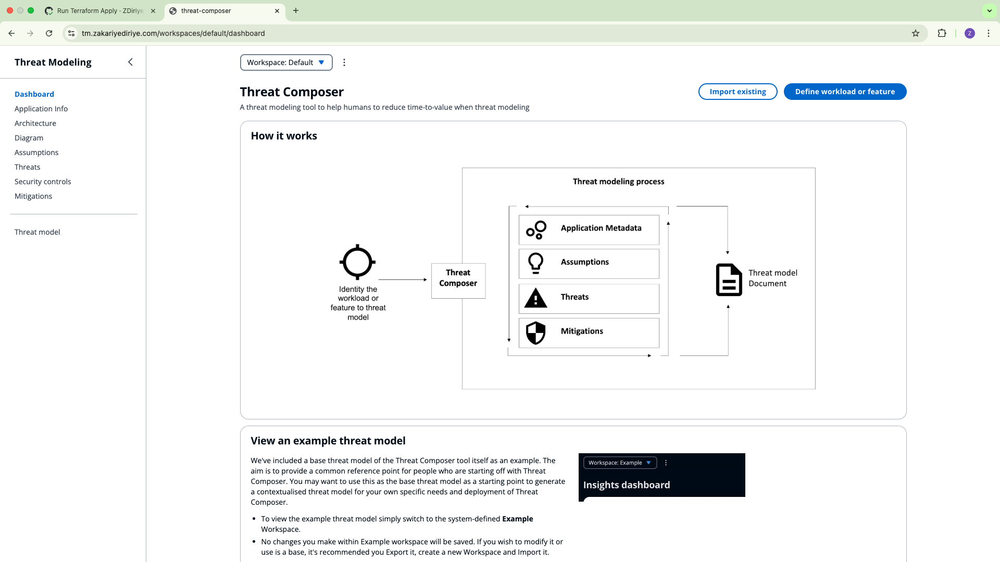
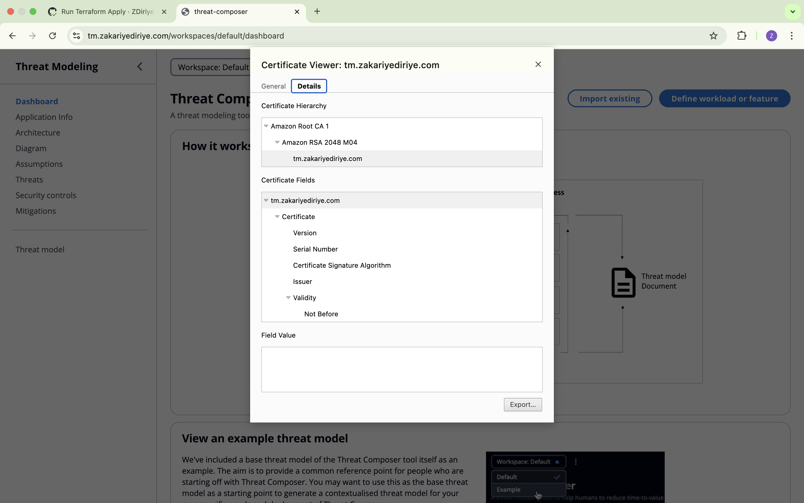
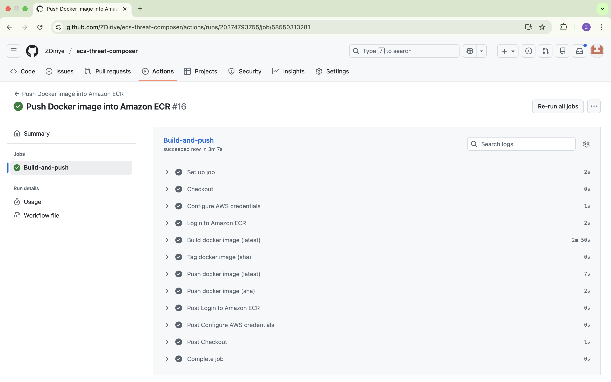
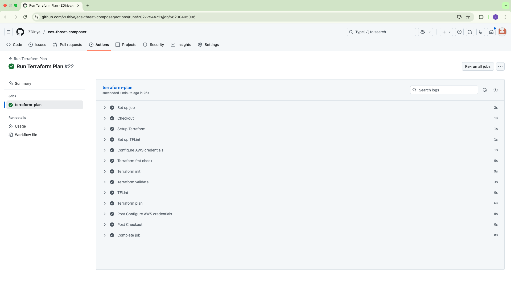
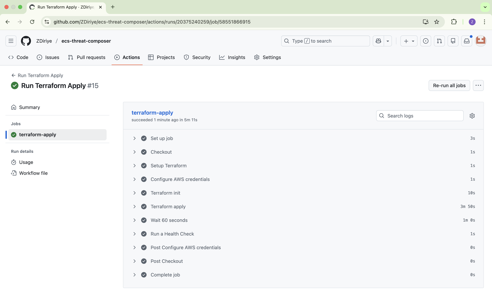
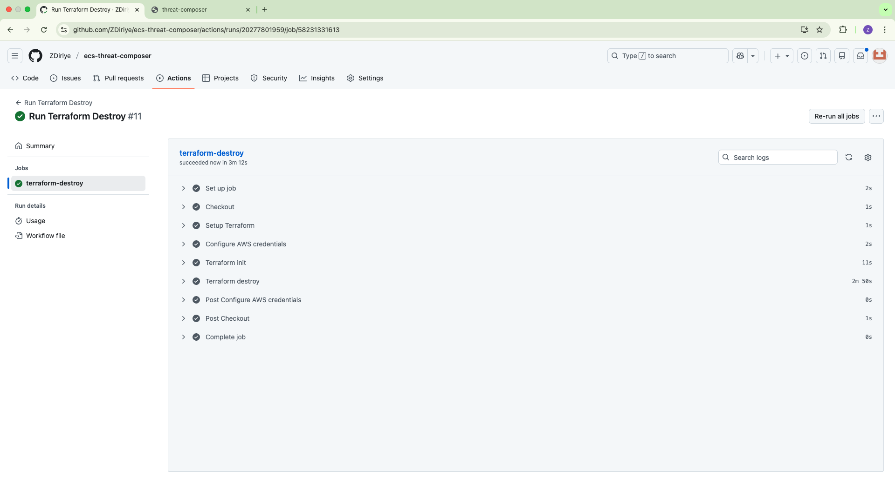

# ECS Threat Composer Deployment

This project is a complete AWS deployment of a containerised web application. It focuses on building the infrastructure using Terraform, packaging the app with Docker and automating deployments using GitHub Actions. The result is a live, production style setup deployed to AWS and accessible through a custom domain over HTTPS.

## Overview

## Project Structure
```text
./
├── .github/
│   └── workflows/
│       ├── push-ecr.yaml
│       ├── tf-apply.yaml
│       ├── tf-destroy.yaml
│       └── tf-plan.yaml
├── app/
├── infra/
│   ├── main.tf
│   ├── provider.tf
│   ├── variable.tf
│   └── modules/
│       ├── acm/
│       ├── alb/
│       ├── ecr/
│       ├── ecs/
│       ├── iam/
│       └── vpc/
└── Dockerfile
```

## Architecture



## Local Setup
Run:
```bash
cd app
yarn install
yarn build
yarn global add serve
serve -s build
```
Then paste in your browser:
```bash
http://localhost:3000
```
### Local Health Check
After the local setup, you can run a health check:
```bash
curl http://localhost:3000/health.json
```

## Live Domain and SSL

### Domain


### ACM Certificate


## CI/CD and Deployment Workflows

### Push Docker Image to ECR


### Terraform Plan


### Terraform Apply


### Terraform Destroy

